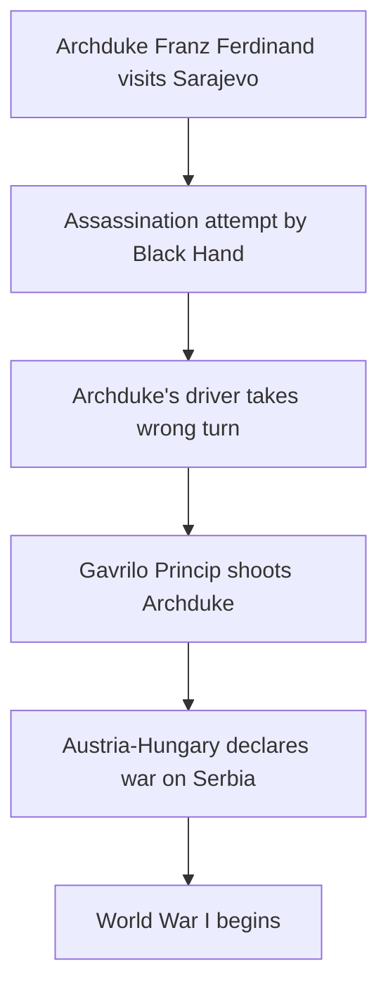

import { Callout, Steps, Step } from "nextra-theme-docs";

# The Assassination of Archduke Franz Ferdinand

The assassination of Archduke Franz Ferdinand of Austria in 1914 was a pivotal moment that directly triggered the start of World War I. This event, which had far-reaching consequences for the course of history, was the result of a remarkable series of coincidences and unplanned circumstances.

**The Spark that Ignited a Conflagration**

On June 28, 1914, the Archduke and his wife were visiting the Bosnian capital of Sarajevo. As their motorcade made its way through the city streets, a member of the Serbian nationalist group "Black Hand" threw a bomb at the Archduke's car. *Remarkably, the bomb missed its target, bouncing off the car and injuring several bystanders instead.*

<Callout type="info">
The initial assassination attempt failed due to a combination of poor planning by the assassins and sheer luck. The Archduke's driver had been instructed to take a different route, but he inadvertently took the wrong turn, bringing the motorcade directly in front of one of the waiting assassins.
</Callout>

## A Series of Coincidences

The events that followed the failed bombing attempt were a cascade of coincidences that ultimately led to the Archduke's demise:

<Steps>
### Step 1
After the bombing, the Archduke insisted on visiting the injured victims in the hospital. His driver, unaware of the change in plans, took a wrong turn, bringing the Archduke's car to a complete stop on a narrow street.

### Step 2
Gavrilo Princip, another member of the "Black Hand" who had failed to participate in the initial attack, happened to be standing on that same street corner, having just purchased a sandwich for his lunch. Seizing the unexpected opportunity, Princip drew his pistol and fired two fatal shots, striking the Archduke and his wife.

### Step 3
The assassination of the Archduke, who was the heir to the Austro-Hungarian throne, set off a chain reaction of events that would ultimately lead to the outbreak of World War I. The assassination was used by Austria-Hungary as a pretext to declare war on Serbia, triggering a series of alliances that drew in the major powers of Europe.
</Steps>

$$ A \rightarrow B \rightarrow C \rightarrow D \rightarrow \text{World War I} $$

The assassination of Archduke Franz Ferdinand was a textbook example of how a seemingly insignificant event, the result of a series of random occurrences, can have profound and far-reaching consequences. This incident serves as a powerful reminder that history is often shaped by the unpredictable and the unforeseeable, and that even the most well-laid plans can be upended by the whims of chance.

For a deeper understanding of this pivotal moment in history, be sure to explore the [Battle of Long Island](/battle-of-long-island) and the [Lusitania Disaster](/lusitania-disaster) sections, which provide additional examples of how consequential coincidences can dramatically alter the course of events.

